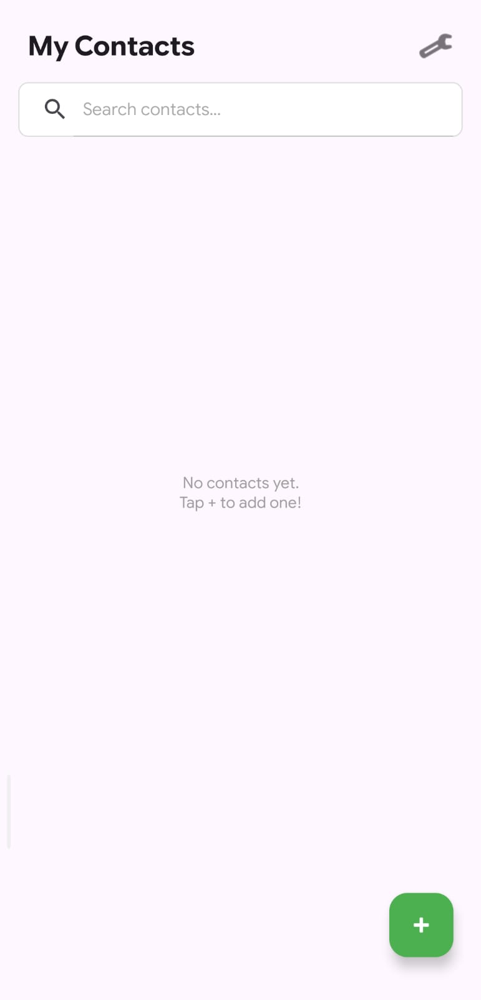
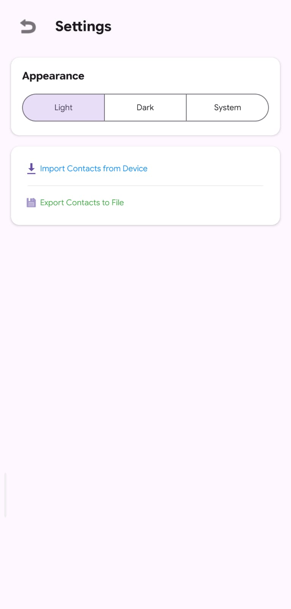
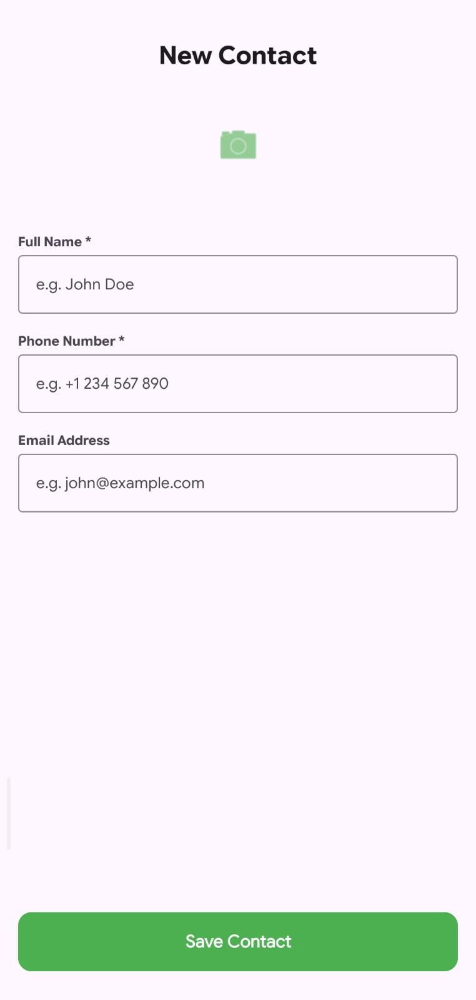

# Contact Manager Android App

A sleek and efficient Android application built with Kotlin to manage your contacts seamlessly. The app utilizes Firebase for real-time data synchronization and secure user authentication.

## 🚀 Features

- **User Authentication**: Secure Sign Up and Login using Firebase Authentication.
- **Real-time Database**: Add, view, and delete contacts with instant updates powered by Firebase Realtime Database.
- **Search Functionality**: Quickly find contacts using the integrated search bar.
- **Quick Actions**: Tap on a contact to view details, make a phone call, or send a message directly from the app.
- **Modern UI**: Clean and responsive design using Material Components and View Binding.
- **Empty States**: Helpful UI feedback when no contacts are available or found during search.

## 🛠️ Tech Stack

- **Language**: [Kotlin](https://kotlinlang.org/)
- **Backend**: [Firebase](https://firebase.google.com/) (Auth & Realtime Database)
- **UI Architecture**: View Binding, ConstraintLayout, RecyclerView
- **Design**: Material Design 3

## 📸 Screenshots

<p align="center">
  
  
  
</p>

*Visual overview of the Contact Manager app interface.*

*Visual overview of the Contact Manager app interface.*

## ⚙️ Setup and Installation

1. **Clone the repository**:
   ```bash
   git clone https://github.com/YOUR_USERNAME/ContactManager.git
   ```

2. **Open in Android Studio**:
   Open the project folder in Android Studio (Arctic Fox or newer recommended).

3. **Firebase Configuration**:
   - Create a new project in the [Firebase Console](https://console.firebase.google.com/).
   - Add an Android App with the package name `com.example.contactmanager`.
   - Download the `google-services.json` file and place it in the `app/` directory of the project.
   - Enable **Authentication** (Email/Password) and **Realtime Database** in the Firebase Console.
   - (Optional) Set your Database Rules to allow authenticated reads/writes.

4. **Build and Run**:
   Sync the project with Gradle files and run the app on an emulator or a physical device.

## 📁 Project Structure

- `MainActivity`: Displays the list of contacts.
- `SignUp`/`LoginActivity`: Handles user onboarding.
- `AddContactActivity`: Interface for adding new contact details.
- `ContactDetails`: Detailed view for a single contact with action buttons.
- `RecycleAdapter`: Manages the display and filtering of the contact list.

## 🤝 Contributing

Contributions are welcome! If you find any issues or have suggestions for improvements, feel free to open a Pull Request or an Issue.

---
*Created as part of an Android Development.*
